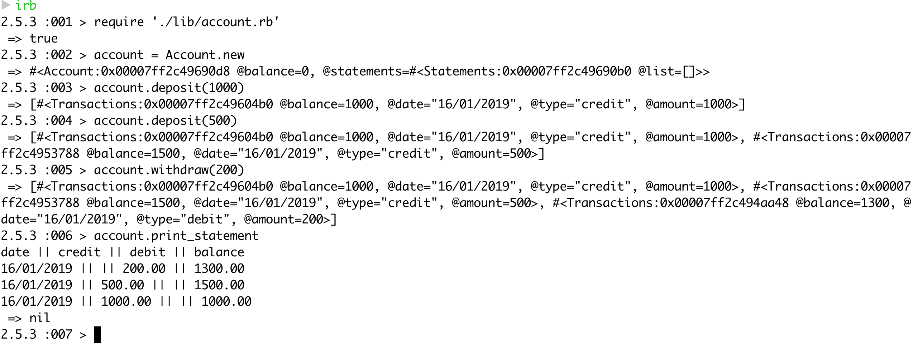

# Bank-Tech-Test-X

Today, you'll practice doing a tech test.

For most tech tests, you'll essentially have unlimited time.  This practice session is about producing the best code you can when there is a minimal time pressure.

You'll get to practice your OO design and TDD skills.

You'll work alone, and you'll also review your own code so you can practice reflecting on and improving your own work.

## Specification

### Requirements

* You should be able to interact with your code via a REPL like IRB or the JavaScript console.  (You don't need to implement a command line interface that takes input from STDIN.)
* Deposits, withdrawal.
* Account statement (date, amount, balance) printing.
* Data can be kept in memory (it doesn't need to be stored to a database or anything).

### Acceptance criteria

**Given** a client makes a deposit of 1000 on 10-01-2012  
**And** a deposit of 2000 on 13-01-2012  
**And** a withdrawal of 500 on 14-01-2012  
**When** she prints her bank statement  
**Then** she would see

```
date       || credit  || debit  || balance
14/01/2012 ||         || 500.00 || 2500.00
13/01/2012 || 2000.00 ||        || 3000.00
10/01/2012 || 1000.00 ||        || 1000.00
```

## Purpose

The purpose of this exercise was to show a through application of the TDD approach. The commit history demonstrates this by showing that a test was created before each implementation and then refactored. It was extremely fun and I hope to be able to more like this in the future as I definitely want the practice!

## Running the tests & linter

Once the repo is forked or cloned, cd into it and run the ```rspec``` command from the command line

To run the linter, please run ```rubocop``` from the command line

## Running the app

Require the file in irb after you cd into the project by using the following command
```
require './lib/account.rb'
```

Carry out the following in the command line after requiring is successful
```
account = Account.new

account.deposit(1000)
account.withdraw(500)
account.withdraw(200)

account.print_statement
```

## Screenshot of app in action


